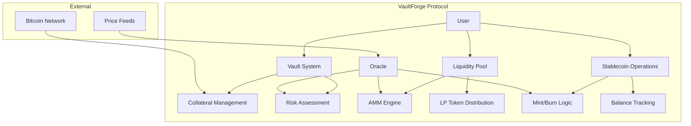
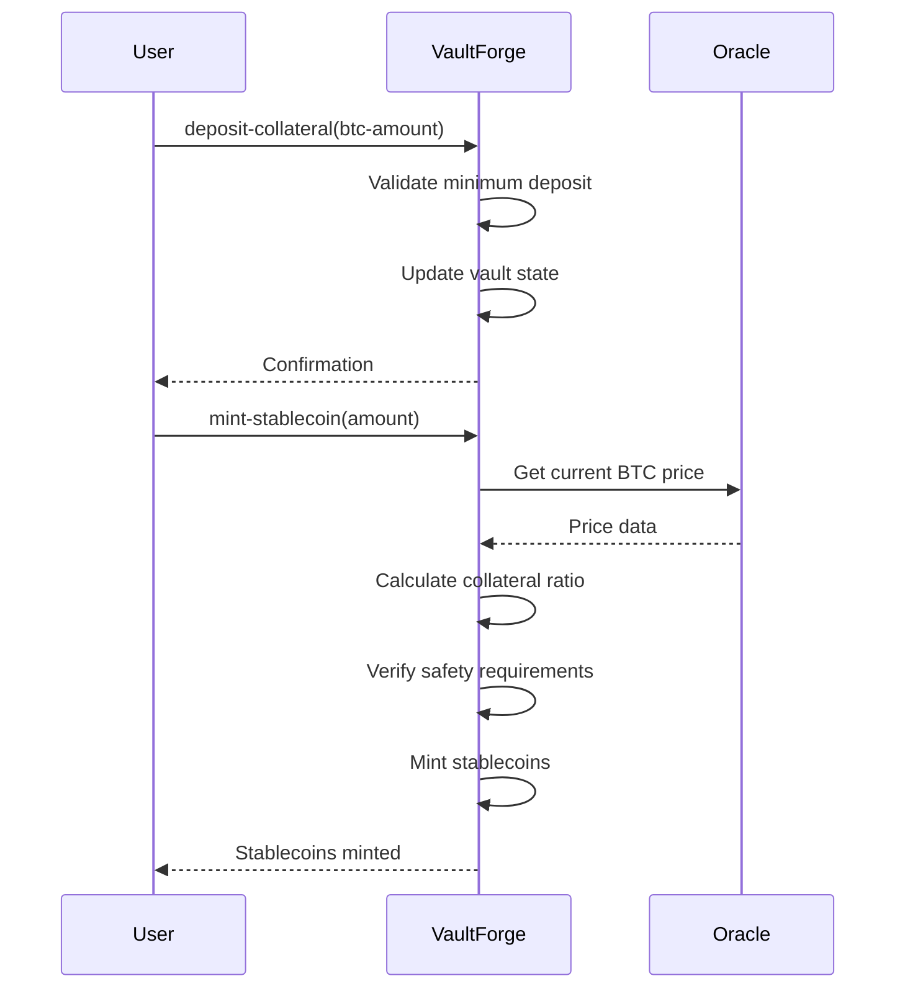
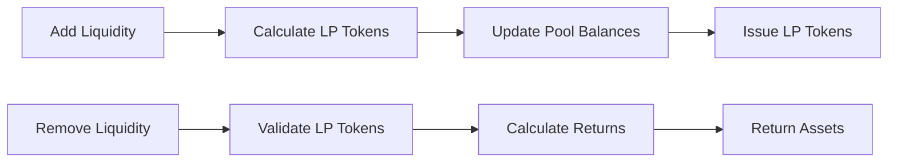

# VaultForge

> **Next-Generation Digital Asset Collateralization Protocol**

[](https://opensource.org/licenses/MIT)
[](https://docs.stacks.co/clarity)
[](https://vitest.dev/)

VaultForge represents a paradigm shift in decentralized finance, offering institutional-grade Bitcoin collateralization mechanics combined with sophisticated automated market operations. The protocol enables users to unlock Bitcoin's liquidity potential through over-collateralized synthetic stablecoin generation, while providing seamless AMM integration for optimal capital efficiency.

## 🌟 Features

- **🔒 Bitcoin Collateralization**: Secure over-collateralized vault system with 150% minimum ratio
- **💰 Synthetic Stablecoin**: Mint USD-pegged stablecoins backed by Bitcoin
- **🏊 Liquidity Pools**: Dual-asset AMM for BTC/Stablecoin trading pairs
- **📊 Oracle Integration**: Real-time BTC/USD price feeds for accurate valuations
- **⚡ Dynamic Risk Management**: Automated liquidation safeguards at 130% ratio
- **🔄 Composable DeFi**: Seamless integration with existing DeFi protocols

## 🏗️ Architecture

### System Overview



### Core Components

#### 1. Vault Management System



#### 2. Liquidity Pool Operations



### Smart Contract Architecture

```
VaultForge Contract
├── Constants
│   ├── Error Codes (1000-1010)
│   ├── Protocol Parameters
│   └── Risk Thresholds
├── State Variables
│   ├── Oracle Price
│   ├── Pool Balances
│   └── Total Supply
├── Data Maps
│   ├── User Balances
│   ├── Collateral Vaults
│   ├── Stablecoin Balances
│   └── Liquidity Providers
├── Private Functions
│   ├── Price Validation
│   ├── Balance Transfers
│   ├── Ratio Calculations
│   └── LP Token Math
├── Public Functions
│   ├── Initialization
│   ├── Vault Operations
│   ├── Stablecoin Operations
│   └── Liquidity Operations
└── Read-Only Functions
    ├── Vault Details
    ├── Pool State
    └── LP Information
```

## 🚀 Quick Start

### Prerequisites

- [Clarinet](https://github.com/hirosystems/clarinet) >= 2.0
- [Node.js](https://nodejs.org/) >= 18
- [TypeScript](https://www.typescriptlang.org/) >= 5.0

### Installation

1. **Clone the repository**

   ```bash
   git clone https://github.com/abolore-install/vault-forge.git
   cd vault-forge
   ```

2. **Install dependencies**

   ```bash
   npm install
   ```

3. **Run tests**

   ```bash
   npm test
   ```

4. **Check contracts**

   ```bash
   clarinet check
   ```

### Development Setup

1. **Start development environment**

   ```bash
   clarinet integrate
   ```

2. **Deploy to devnet**

   ```bash
   clarinet deploy --devnet
   ```

3. **Run continuous testing**

   ```bash
   npm run test:watch
   ```

## 📖 Usage

### Basic Vault Operations

#### Initialize Protocol

```clarity
;; Initialize with BTC price at $50,000 (6 decimal precision)
(contract-call? .vault-forge initialize u50000000000)
```

#### Deposit Collateral

```clarity
;; Deposit 0.1 BTC (10,000,000 satoshis)
(contract-call? .vault-forge deposit-collateral u10000000)
```

#### Mint Stablecoins

```clarity
;; Mint $1000 worth of stablecoins
(contract-call? .vault-forge mint-stablecoin u1000000000)
```

### Liquidity Pool Operations

#### Add Liquidity

```clarity
;; Add 0.01 BTC and $500 stablecoins to pool
(contract-call? .vault-forge add-liquidity u1000000 u500000000)
```

#### Remove Liquidity

```clarity
;; Remove liquidity using LP tokens
(contract-call? .vault-forge remove-liquidity u1000000)
```

### Query Functions

#### Check Vault Details

```clarity
;; Get vault information for a user
(contract-call? .vault-forge get-vault-details 'SP1HTBVD3JG9C05J7HDJKDYR99M9Q4QSDZ8BQ9AJDM)
```

#### Get Pool State

```clarity
;; Check current pool balances and metrics
(contract-call? .vault-forge get-pool-details)
```

## 🔧 Protocol Parameters

| Parameter | Value | Description |
|-----------|-------|-------------|
| **Minimum Collateral Ratio** | 150% | Required overcollateralization |
| **Liquidation Threshold** | 130% | Automatic liquidation trigger |
| **Minimum Deposit** | 0.01 BTC | Smallest collateral deposit |
| **Pool Fee Rate** | 0.3% | AMM trading fees |
| **Price Precision** | 6 decimals | Oracle price accuracy |
| **Max BTC Price** | $1,000,000 | Price ceiling protection |
| **Max Mint Amount** | $10,000 | Single transaction limit |

## 🛡️ Security Features

### Risk Management

- **Over-collateralization**: 150% minimum ratio ensures protocol solvency
- **Liquidation Protection**: Automatic liquidation at 130% prevents bad debt
- **Price Validation**: Oracle price bounds prevent manipulation
- **Balance Verification**: Comprehensive balance checks on all transfers

### Access Controls

- **Owner-only Functions**: Critical operations restricted to contract owner
- **Input Validation**: All user inputs validated against bounds
- **State Consistency**: Atomic operations ensure consistent state updates

### Error Handling

```clarity
;; Comprehensive error codes for debugging
ERR-NOT-AUTHORIZED (u1000)
ERR-INSUFFICIENT-BALANCE (u1001)
ERR-INVALID-AMOUNT (u1002)
ERR-INSUFFICIENT-COLLATERAL (u1003)
ERR-POOL-EMPTY (u1004)
ERR-SLIPPAGE-TOO-HIGH (u1005)
ERR-BELOW-MINIMUM (u1006)
ERR-ABOVE-MAXIMUM (u1007)
ERR-ALREADY-INITIALIZED (u1008)
ERR-NOT-INITIALIZED (u1009)
ERR-INVALID-PRICE (u1010)
```

## 🧪 Testing

### Test Categories

1. **Unit Tests**
   - Contract initialization
   - Vault operations
   - Stablecoin minting/burning
   - Liquidity pool functions

2. **Integration Tests**
   - End-to-end workflows
   - Multi-user scenarios
   - Edge case handling

3. **Security Tests**
   - Access control validation
   - Input boundary testing
   - Error condition verification

### Running Tests

```bash
# Run all tests
npm test

# Run with coverage
npm run test:report

# Watch mode for development
npm run test:watch

# Check contract syntax
clarinet check
```

## 📊 Economic Model

### Collateralization Mechanics

- **150% Minimum Ratio**: Ensures protocol remains solvent during market volatility
- **Dynamic Liquidation**: Protects against cascade failures
- **Fee Structure**: Sustainable revenue model for protocol development

### Liquidity Incentives

- **LP Tokens**: Proportional ownership of pool assets
- **Trading Fees**: Revenue sharing with liquidity providers
- **Impermanent Loss Protection**: Advanced pool mathematics minimize IL

## 🗺️ Roadmap

### Phase 1: Core Protocol ✅

- [x] Basic vault system
- [x] Stablecoin minting/burning
- [x] AMM liquidity pools
- [x] Oracle integration

### Phase 2: Advanced Features 🚧

- [ ] Multi-collateral support
- [ ] Governance token
- [ ] Yield farming rewards
- [ ] Flash loan functionality

### Phase 3: Ecosystem Integration 📋

- [ ] Cross-chain bridges
- [ ] DEX aggregator integration
- [ ] Lending protocol partnerships
- [ ] Mobile wallet support

### Phase 4: Enterprise Features 📋

- [ ] Institutional vault tiers
- [ ] Advanced risk analytics
- [ ] Regulatory compliance tools
- [ ] White-label solutions

## 🤝 Contributing

We welcome contributions from the community! Please see our [Contributing Guidelines](CONTRIBUTING.md) for details.

### Development Process

1. Fork the repository
2. Create a feature branch
3. Make your changes
4. Add tests for new functionality
5. Ensure all tests pass
6. Submit a pull request

### Code Standards

- Follow Clarity best practices
- Maintain test coverage above 90%
- Document all public functions
- Use meaningful variable names

## 📄 License

This project is licensed under the MIT License - see the [LICENSE](LICENSE) file for details.
